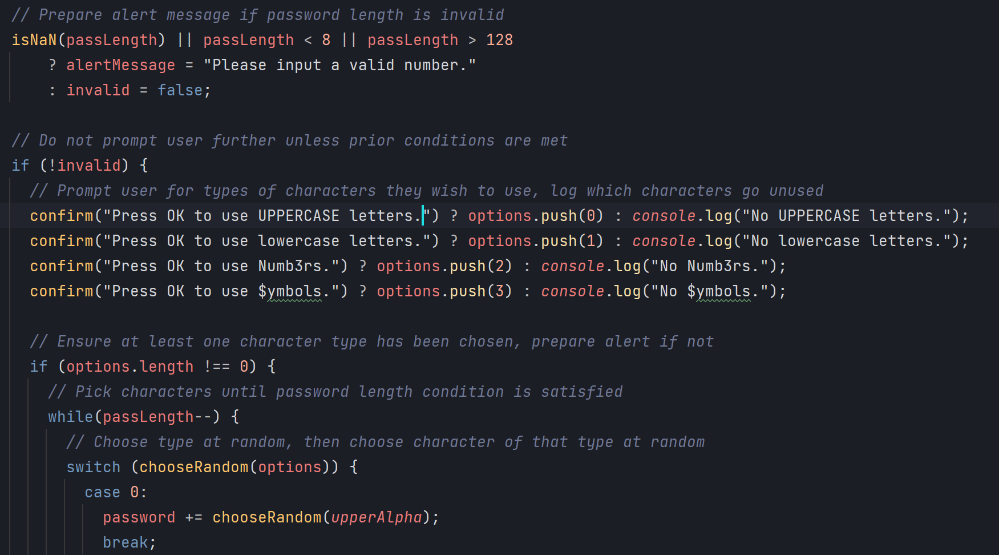
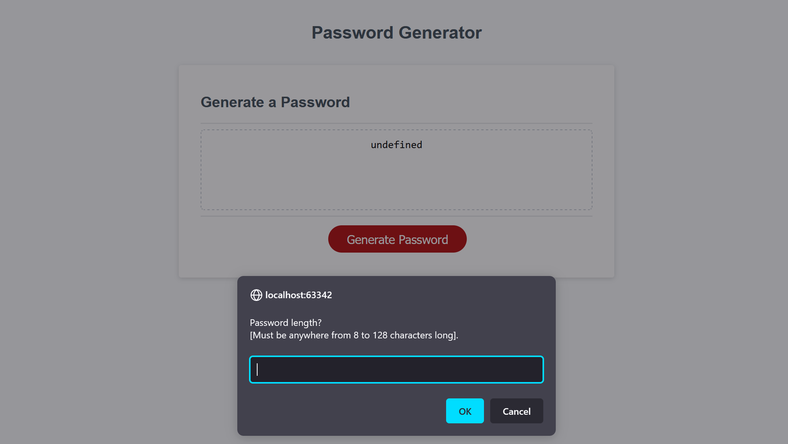

# Password Generator - Module 3 Challenge

## Table of Contents

- [Description](#description)
- [Installation](#installation)
- [Usage](#usage)
- [Credits](#credits)
- [License](#license)
- [Code Example](#Code-Example)
- [Live Site](#Live-Site)

## Description
For this project, I have built the necessary functions and added it to existing code infrastructure. The functionality
is that of generating a password based on information prompted from the user.

## Installation

(No installation required)

## Usage

Click the "Generate Password" button, then follow the prompts. 

Feel free to inspect the code! To open the Chrome DevTools,
try pressing Command+Option+I (macOS) or Control+Shift+I (Windows) while viewing the hosted site from within
Google Chrome.

## Credits

Original code infrastructure supplied by University of Kansas Coding bootcamp, generatePassword() function and
necessary component functions and constants developed by Spencer Stewart.

Personal links:
[GitHub](https://github.com/SpencerRSMS/)
[LinkedIn](https://www.linkedin.com/in/r-spencer-stewart/)

## License

Please refer to the LICENSE file for more information.

## Features

Randomly generates a password with desired character types between 8 and 128 characters in length.
[GitHub repository](https://github.com/SpencerRSMS/password-generator).

## Code-Example
#### Some Code Snippets:

## Live-Site
#### Click [here](https://spencerrsms.github.io/password-generator/) for the [live site](https://spencerrsms.github.io/password-generator/)!
